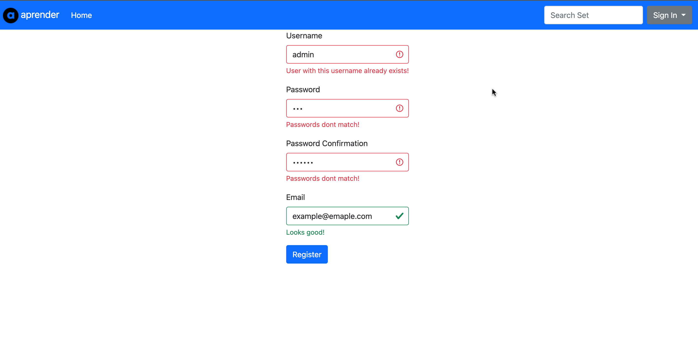
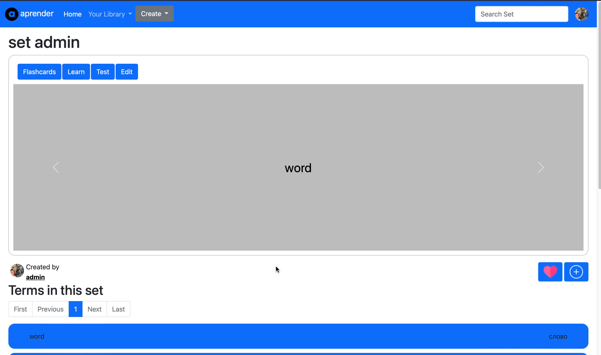
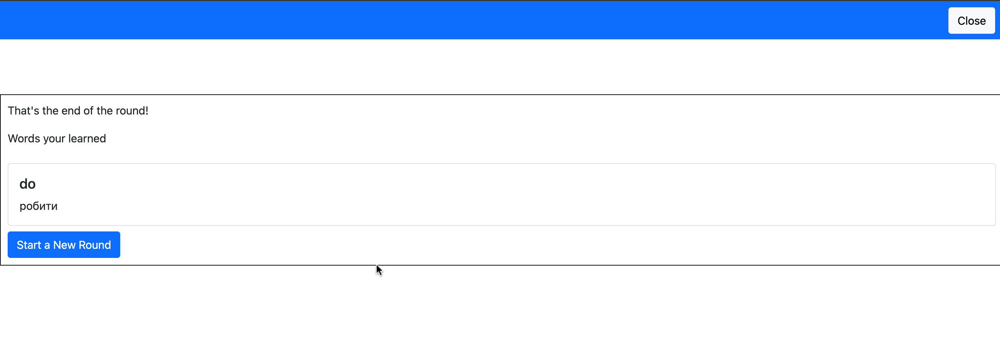
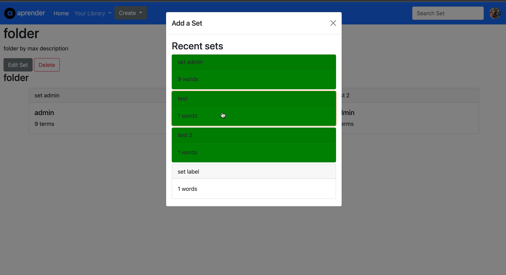
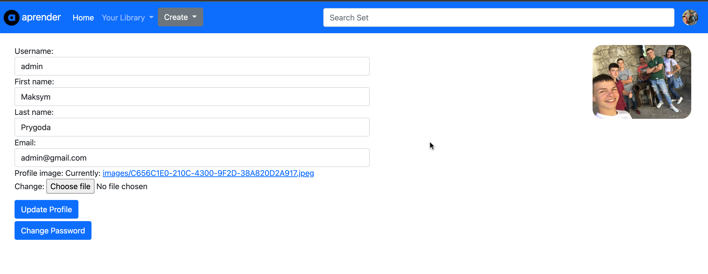
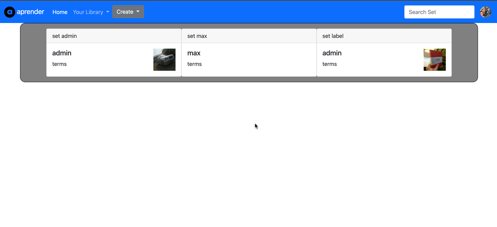

# Aprender

This web app is a clone of wide popular software for learning words - Quizzlet
Here you can create your own sets, separate them in folders, and, of course, learn words (set of term and its definition)!

## Sign Up

To start exploring the app in full scale, you should sign up. After entering valid data,
you will shown a welcome message telling everything went successfully

## Learn Modes

All in all there are 3 learning modes: Flashcards, Learning and Test mode
Initially all words are added to not-starred category, during the training words will be 
added to higher or lower category, depending wheter you answered correctly or not.

### Flashcards

In Flashcard mode you can get to know with words and their definitions, respectively
Last seen word will be memorised and shown individually to each person on set main page.

### Learn

In this mode you can deepen your understanding of terms and their definition by choosing right answers with
definition to a term, at the end of each round you will be exposed to all the words studied in the round.

### Test

When test mode entered, firstly you are shown to some settings, which adjust how the test will go
You can define number of question asked, chose whether there will be not starred words, and finally,
chose which mode will present in the test
This learning mode consits of all the previoous modes and another one - True or False.
#### True or False
In True or Flase mode you are given a word and its defintion, it's up to you decide whether it's a correct
statement or not.

## Sets and Folders

If you want to extend you own set, you can enter into edit mode, where words can be edit and new ones added
To group sets by theme, you would want to create a folder and add there corresponding sets
Also, sets can be "liked" (added to favorite category), and can be seen in favorite section, which is located at Your Library tab

## Profile

On the profile page you can see the set and folders of the user

If some profile settings aren't quite the ones you want to be, you can always get to the settings page and change them
as you will

## Search

If you know there is a set you want to study, but can't find it on the main page, you can always use the search field in the upper right corner to find the needed set

## Distinctiveness and Complexity
This project is done solely by one person, therefore it took some time to think about all the implementation details
and thereafter implement them all.
Many bugs were catched during the process, yet I'm assured there will be others undiscovered.
Aprender distincts from all the others projects, implemented in the  CS50W course because of its size and complexity.
Many js scripts are used here, some additional plugins as twbs, used for pagination on set main page, also Bootstrap modules are
used quite a few times.
Besides that, mobile first approach is used here, meaning that mobile design was the initial look of the pages, and desktop view
was craeted afterwards
Django models also are used quite a lot in this project, for creating Learn Path individually for each user. Words model, Folder model etc. Plethora of js (for loading user sets, adding sets to folder, add set to favorites and so on) is used here too.
Before first lines of code were written, ER-model (initially on a piece of paper, then in Access) was created, to better understand
nuances of some database related details. From the initial commit to the last all the changes were described in commit messages, 
some others git commands were used as checkout, reset, log, status, which also helped to learn the ropes of using git.
Some interesting problems aroused during the development and corresponding workarounds were used due to the lack of experience, as how to store the order of objects, added to Many-to-Many relation or updating uaser profile.

